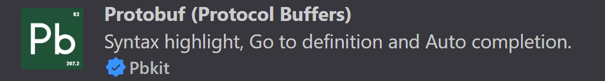
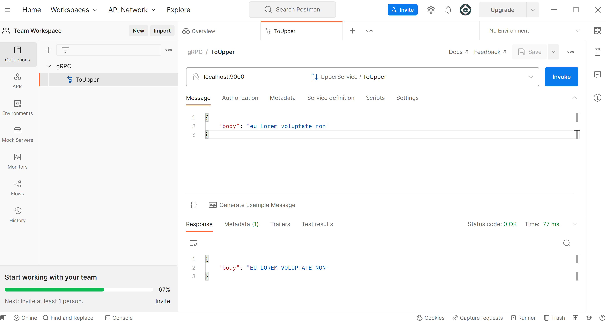

# golang-simple-grpc-service

This simple grpc service accepts a string, and returns the same string in uppercase.

## Installing gRPC packages

```sh
go install google.golang.org/protobuf/cmd/protoc-gen-go@v1.28
go install google.golang.org/grpc/cmd/protoc-gen-go-grpc@latest
go get "google.golang.org/grpc"
go get github.com/fullstorydev/grpcurl/cmd/grpcurl
```

## Installing VSCode plugins

For editing `.proto` files in VSCode, install this extension.



It was the only one that worked for me on my Windows 10 machine.

## Installing Protcol Compiler on Windows 10

Looks like there isn't an easy way to do this on Windows.

We are referred to [Install pre-compiled binaries (any OS)](https://grpc.io/docs/protoc-installation/#install-pre-compiled-binaries-any-os).

There is a link to https://github.com/protocolbuffers/protobuf/releases .

For windows, download `protoc-21.9-win64.zip`.

I extracted all contents of the zip into the Downloads directory, and then copied
protoc.exe to C:\Users\domin\go\bin which is on my GOPATH.


## Compiling your '.proto' file

There are a lot of old YouTube videos or StackOverflow discussions with
`out-dated` commands and instructions that will lead you `nowhere` fast.
I guess the technology changed quite a bit over the years.

This is the best source I found : https://developers.google.com/protocol-buffers/docs/gotutorial#compiling-your-protocol-buffers


I used this command

```sh
protoc -I=. --go_out=. --go-grpc_out=. ./upper.proto
```

## Compile errors registering your server

You need to embed `UnimplementedUpperServiceServer`
in ./upper.go's

```go
type Server struct {
	UnimplementedUpperServiceServer
}
```

to avoid compile errors in server.go on

```go
upper.RegisterUpperServiceServer(grpcServer, &s)
```

Reference: https://stackoverflow.com/questions/65079032/grpc-with-mustembedunimplemented-method


## Enable Reflection for server

https://github.com/grpc/grpc-go/blob/master/Documentation/server-reflection-tutorial.md

If you don't enable reflection on your server, clients like Postman and grpcurl
will have difficulty listing your apis.


## Running your server

```sh
go run server.go
```

output

```log
Serving on port 9000
2022/11/19 21:48:20 INFO: Serving on port 9000
```

When you interact with the server with requests, you will
see other log messages:

```log
2022/11/19 21:48:58 Received message body from client: eu Lorem voluptate non
2022/11/19 21:48:58 Returning message body to client: EU LOREM VOLUPTATE NON
```

## gRPC Clients

### grpc Curl

A curl-like command for gRPC.

https://princepereira.medium.com/install-grpccurl-in-ubuntu-6ad71fd3ed31


```sh
grpcurl -plaintext localhost:9000 list
```

outputs

```log
upper.UpperService
```

```sh
grpcurl -plaintext localhost:9000 list upper.UpperService
```

outputs

```log
upper.UpperService.ToUpper
```

```sh
grpcurl -plaintext -d '{"body": "eu Lorem voluptate non"}' localhost:9000 upper.UpperService/ToUpper
```

outputs

```log
{
  "body": "EU LOREM VOLUPTATE NON"
}
```

### PostMan

Had to create a free account to create a workspace to be able to create request with gRPC flavor.

https://learning.postman.com/docs/sending-requests/grpc/grpc-request-interface/

Make sure that TLS is disabled.

The url is: `localhost:9000`.

Make sure that your server enabled reflection, otherwise you won't be able to list any APIs.

In the API list, choose `Use server reflection`, and then select UpperService/ToUpper

Click on `Generate Example Message` on the Message tab.

Press Invoke

You should see the uppercased-response.



